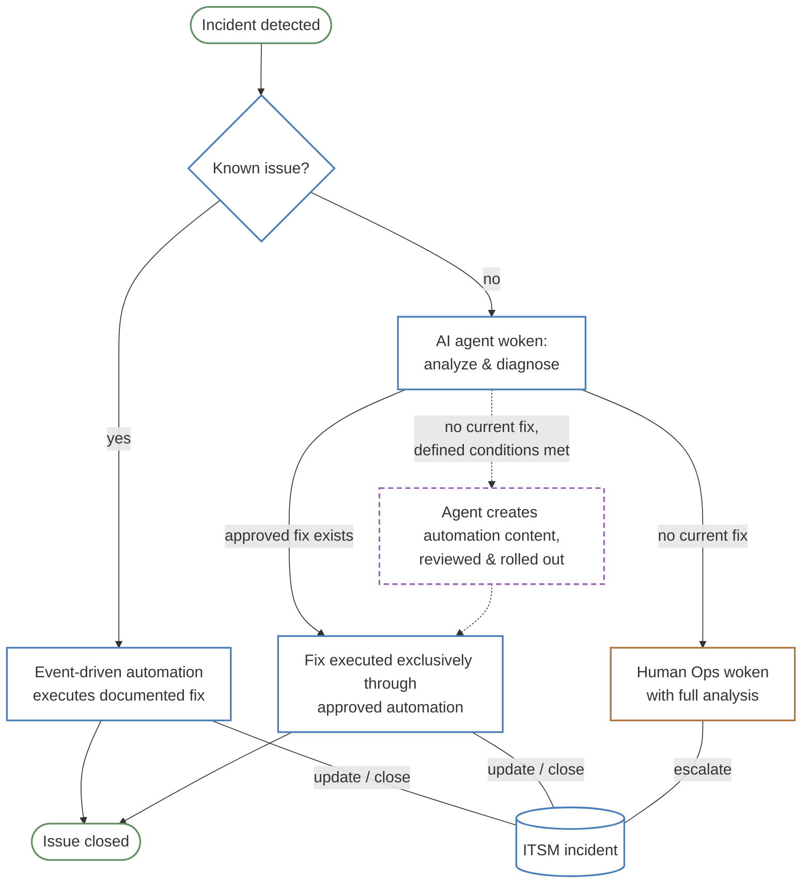
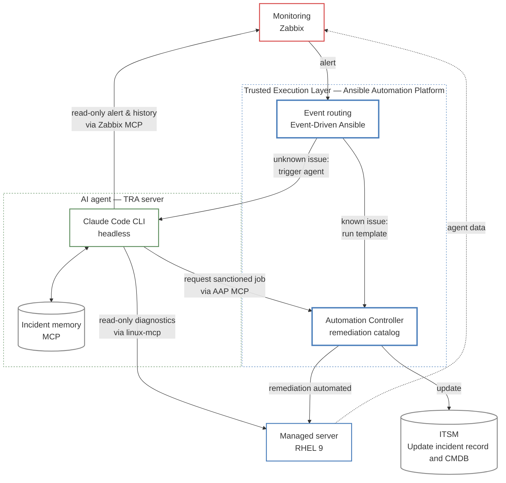

# AIOps self-healing demo

AI-driven incident remediation for enterprise infrastructure — with the blast radius bounded by architecture, not by prompting.

> **This is a functionality demo, not a production reference architecture.** No attempt is made to follow least-privilege, security hardening, or production-grade guidelines. That is intentional — the goal is to demonstrate the architecture and the self-healing flow, not to provide a deployable solution.

## What this is

A reproducible demo in which infrastructure incidents are detected, diagnosed, and remediated automatically — including incidents nobody wrote a runbook for. An AI agent investigates the unknown cases and resolves them, yet at no point holds the ability to change systems directly: every change, without exception, runs through the organization's governed automation platform.

## The core idea

An incident is resolved at the lowest capable level. Known issues never wake the AI; the AI never acts outside approved automation; humans are woken with an analysis, not an alert.



Solid borders are the working demo. The dashed purple branch is **experimental** — the agent authoring new automation content is a research direction, not a shipped capability.

## Demo scenarios

**Stage 1 — self-healing a monitored host (Level 1)**

1. A package is removed from the managed host (`sudo dnf remove -y zabbix-agent2`), breaking monitoring
2. Zabbix detects agent unavailability after the configured timeout
3. Zabbix fires an alert via the Event-Driven Ansible media type to an EDA Event Stream
4. EDA rulebook matches the trigger name and launches an AAP job template
5. The job template invokes Claude Code CLI in headless mode
6. Claude investigates the host through Phase 1–4 (Zabbix MCP → linux-mcp → AAP MCP)
7. Claude identifies the missing package and launches the "Deploy Zabbix Agent" job template via AAP MCP
8. Zabbix confirms recovery after its check interval expires

**Stage 2 — agent-authored remediation (Level 2)** — TBD

The agent generates Ansible playbook content to address an incident with no existing fix, then submits it for machine or human approval before execution.

## The four response levels

Every incident is handled at the lowest level capable of resolving it. Each level up grants the responding system more autonomy, accompanied by more controlling oversight:

- **Level 0** — deterministic runbooks
- **Level 1** — AI-driven diagnosis, constrained to approved remediations
- **Level 2** — agent-authored content under review
- **Level 3** — full human escalation

Which level handles an incident is not a runtime decision made on a whim; it is defined by policy and enforced by architecture.

**Level 0 — Known issue, known fix.**
The incident matches a documented pattern. A predefined remediation playbook executes deterministically through Event-Driven Ansible on AAP — fully audited, no AI involved. If the fix doesn't clear the issue, escalation to Level 1 is automatic.

**Level 1 — Unknown issue, known remediations.**
The incident doesn't match any documented pattern, or the known fix did not clear the issue. The AI agent is woken to investigate: it examines the affected systems read-only, correlates monitoring data with system state, and determines the cause — then resolves it strictly by selecting from the pre-approved remediation catalog. The agent reasons freely, but acts only within the approved catalog.

**Level 2 — Unknown issue, no fitting remediation.** *(experimental)*
The catalog holds no answer. The agent drafts a new remediation and submits it as a proposal — it never executes its own work. An independent second agent reviews for sanity and policy compliance before the proposal enters the catalog. Whether machine review suffices or a human gate is always required is an open question.

**Level 3 — Human escalation.**
Judgment is required beyond what any automation should exercise. The agent compiles the complete diagnostic picture — findings, attempted remediations, ruled-out causes — and wakes a human, who starts at the analysis rather than at a raw alert.

> **Management summary.** The bulk of incidents resolve at Level 0 — machine-speed, audit-grade, with no one paged at 3 a.m. The AI agent absorbs the long tail of unknowns at Level 1, working exclusively through the automation platform the organization already owns and governs — existing investment, extended rather than replaced. Escalations that do reach engineers arrive pre-analyzed, cutting time-to-resolution where expert time is scarcest. The AI agent's autonomy grows only as the remediation repertoire grows with it: new documented playbooks are added to the catalog, expanding what the agent can resolve — always through the same governed, auditable execution path.

## Component roles

These are the choices for this demo. Each role can be filled by other tools — the architecture depends on the roles, not the products.

| Role | This demo | Notes |
|------|-----------|-------|
| Monitoring & event source | Zabbix | Any monitoring system capable of forwarding events |
| Automation & orchestration — the Trusted Execution Layer | Ansible Automation Platform (AAP) incl. Event-Driven Ansible | Sole component that changes systems |
| Managed test server (monitored & remediated) | RHEL 9 | Stand-in for any managed fleet |
| Agent runtime server — tools, runtimes, admin (TRA) | RHEL 9 | Hosts the AI agent and its integration layer |
| AI agent | Claude Code (CLI, headless) | Any agentic LLM runtime with policy enforcement |

## Technical architecture



**Every arrow that changes state originates from the Trusted Execution Layer.** The AI agent has no direct write path anywhere.

## Guiding principles

- **The automation platform is strictly the only component that changes configurations or executes jobs.** It is the **Trusted Execution Layer**. LLMs are exceptionally creative — and exactly for that reason not reliable enough to follow operational policy unconditionally. Creativity belongs in diagnosis, never in execution.
- **All agent communication runs through defined integration interfaces (MCP)** — to monitoring, to the managed server, to the automation platform.
- **Read-only wherever possible.** The agent's interfaces to the managed server and to monitoring are read-only by construction, not by convention.
- **The agent operates under policy enforcement** that limits creative side activities outside operational policy — enforced in code, not requested in prompts.
- **Credentials never reach the agent.** AAP returns `$encrypted$` for all sensitive fields post-creation, enforces `no_log` protection even at maximum verbosity, and injects credentials into the execution environment only at runtime. The agent can launch a job template that uses credentials — it cannot read, extract, or exfiltrate them.

> **Management summary.** Control is not a promise made by the AI — it is a property of the architecture. The single governed execution path preserves every existing approval, audit, and compliance mechanism the organization already relies on. Adopting AI-driven operations this way carries no new class of privileged actor: the platform you already trust remains the only thing touching your systems.

## Repository layout

```
docs/                          build guide (00 through 06), troubleshooting
docs/todo/                     backlog and design notes
playbooks/                     AAP project content used by the remediation templates
extensions/eda/rulebooks/      EDA rulebooks (level routing)
AI_Instructions_Guardrails/    agent guardrails (CLAUDE.md)
```

## Status

Working demo; documentation in progress. Failure modes and design decisions are documented deliberately — real behavior over polished success.
