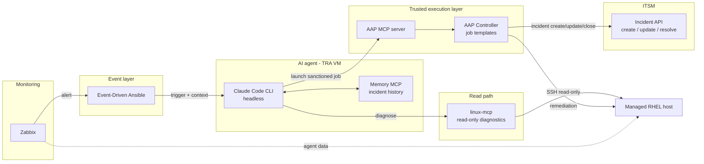

# AIOps self-healing demo

AI-driven incident remediation for enterprise infrastructure — with the blast radius bounded by architecture, not by prompting.

## What this is

A reproducible demo in which an AI agent autonomously handles an infrastructure incident end to end: a monitoring alert fires, the agent investigates the affected system, remediates it through the automation platform, and updates the incident record — without a human in the loop, and without the ability to act outside sanctioned paths.

The pipeline: **Zabbix** detects a problem and forwards the alert through **Event-Driven Ansible (EDA)** to a headless **Claude Code CLI** session. Claude diagnoses the system through **linux-mcp** (read-only by design) and remediates exclusively by launching pre-approved **Ansible Automation Platform (AAP)** job templates via the AAP MCP server. Incident records in the **ITSM system** are opened, updated, and resolved through the same governed path. Incident context is persisted in a memory layer across runs.

## Why this matters for tech leaders and architects

**The problem with "AI + root access":** giving an LLM shell access to production is a non-starter in any regulated or risk-aware organization — LLM instruction-following is probabilistic, and no prompt guarantees behavior. Most AIOps demos quietly ignore this.

**The approach here — trusted execution layer:**

- **Read and write paths are architecturally separated.** The AI can investigate freely (read-only diagnostics), but every change to a system goes through AAP — versioned, peer-reviewed job templates with full audit trail, RBAC, and credentials the AI never sees.
- **The blast radius is a design property, not a behavioral hope.** Even a fully misbehaving agent run can only execute the sanctioned automation catalog against the scoped inventory. Guardrails are enforced in code (tool allowlists, pre-execution hooks), not requested in prompts.
- **Existing investments are reused, not replaced.** Your Ansible content, your monitoring, your ITSM process stay authoritative. The AI is a new consumer of existing governed interfaces — not a new privileged actor.
- **Auditability is inherited.** Every remediation is an AAP job with logs, every incident a normal ITSM record. The AI run itself is logged turn by turn.

**What you get from reproducing it:** a concrete, criticizable reference architecture for evaluating agentic AI in operations — including its documented failure modes, which are part of this repository rather than edited out.

## Architecture



The critical property is visible in the diagram: **every arrow that changes state — on the target host and in the ITSM system — originates from AAP.** The AI agent has no direct write path anywhere.

## Demo scenarios

- **Stage 1 — Agent failure:** the Zabbix agent is removed from the target host. Zabbix raises a nodata alert, EDA triggers the AI, which diagnoses the missing agent via linux-mcp and restores it via the corresponding AAP job template.
- **Stage 2 — Package failure:** with monitoring restored, a database package is removed. Detection, diagnosis, and remediation run through the same pipeline using a separate job template — demonstrating that the catalog, not the AI, defines what remediation is possible.

Each scenario opens, updates, and resolves an ITSM incident along the way.

## Repository layout

```
docs/            architecture, design decisions, documented failure modes
docs/build/      sequential reimplementation guide (start at 00-starting-setup.md)
playbooks/       AAP project content used by the job templates
rulebooks/       EDA rulebooks
config/          sanitized reference configuration (AAP installer inventory, MCP configs, Claude Code settings)
```

## Status

Working demo; documentation in progress. Failure modes and design decisions are documented deliberately — real behavior over polished success.
